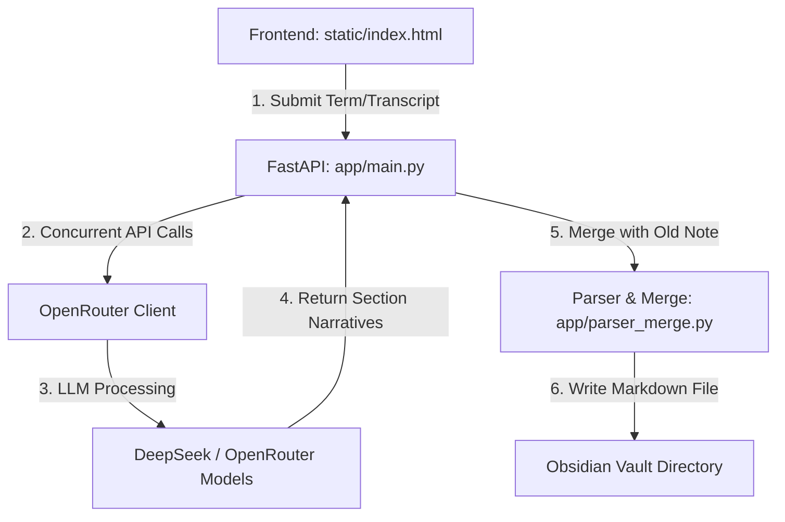

# MemoryWiki: Technical Handoff & Bulletproof Blueprint

MemoryWiki is an automated vocabulary generation and oral diagnostic system integrated with Obsidian. It features a FastAPI backend and a minimalist HTML5 frontend, utilizing OpenRouter (LLM APIs like DeepSeek) to run concurrent section-by-section analysis prompts.

This document serves as the **unified source of truth** for the next development sprint, detailing current architecture, completed works, a critical robustness bug-fix registry, and specifications for new structural features (word subcategorization and favorites).

---

## 1. System Architecture & Flow of Execution



### Core Codebase Map
*   **[generator/app/main.py](file:///home/alex/Ai-chinese/MemoryWiki/generator/app/main.py)**: Manages endpoints, routes generated files to vault directories, and orchestrates asynchronous API calls with concurrency limits.
*   **[generator/app/parser_merge.py](file:///home/alex/Ai-chinese/MemoryWiki/generator/app/parser_merge.py)**: Handles Markdown parsing/serialization using `frontmatter` and merges incoming LLM responses with hand-edited Obsidian callouts (`> [!key]`) idempotently.
*   **[generator/app/openrouter_client.py](file:///home/alex/Ai-chinese/MemoryWiki/generator/app/openrouter_client.py)**: Async client wrapping OpenRouter API calls with a rate-limit (429) retry backoff loop.
*   **[generator/config/prompts.yaml](file:///home/alex/Ai-chinese/MemoryWiki/generator/config/prompts.yaml)**: Template definitions for system/user prompts across all card types: `bisilabo`, `polisilabo`, `chengyu`, `comparacion`, `estructura`, and `correccion_alocacion`.

---

## 2. Completed Sprint Achievements (All Done)
*   **Direct Start & Noise Elimination**: Stripped all LLM preamble boilerplate (e.g. "Aquí tienes el análisis") and word repetition from all narrative prompt configurations in `prompts.yaml`.
*   **Compact Formatting**: Enforced a strict maximum length of 3 to 4 sentences in a single continuous paragraph for all Spanish narrative analysis fields.
*   **Audio Transcription Corrections**: Refactored the `correccion_alocacion` pipeline to present a clean, native Pinyin-free target in `veredicto_optimizacion` for direct oral practice replication.
*   **Active Server**: The service runs on port `8082` controlled under systemd (`systemctl --user status ai-chinese-server`).

---

## 3. New Requirements: Intelligent Subcategorization & Favorites

To avoid folder clutter (hundreds of loose markdown files under `bisilabos/`) and allow easy note filtering, we are introducing two new features. **Success Rate: 98% (Extremely Viable, low impact on prompts, purely logical backend additions).**

### A. Subfolders by Word Type (within `bisilabos/`)
*   **Concept**: Inside `vault/nemotecnia/unified-words/bisilabos/`, files should be saved under subfolders reflecting their grammatical category (e.g., `bisilabos/verbo/`, `bisilabos/sustantivo/`, `bisilabos/adjetivo/`, `bisilabos/otros/`).
*   **Implementation logic for `find_word_file`**:
    1.  When searching for an existing word, the system must scan recursivelly: look directly in all subdirectories of `bisilabos/` (e.g. `bisilabos/verbo/明白.md`) so that existing notes are detected regardless of their word type subfolder.
    2.  For new notes, the target folder is determined by parsing the `word_type` retrieved from the initial structured metadata request. If `word_type` is not yet available, a default directory (e.g., `bisilabos/otros/` or `bisilabos/adjetivo/`) is used.
    3.  If the word type of an existing note changes upon regeneration, the system should automatically move the file to the new type subfolder to prevent duplicate files.

### B. Frontmatter "Favorite" Marker
*   **Concept**: Add a `favorite` boolean metadata attribute to the YAML frontmatter of the markdown notes.
*   **Implementation logic**:
    1.  During new note serialization, write `favorite: false` to the frontmatter by default.
    2.  `merge_notes` must preserve the existing value of `favorite` (idempotency). If the user marks `favorite: true` in Obsidian, subsequent regenerations of that word must keep it `true`.

---

## 4. Robustness Sprint: Approved Fixes & Enhancements

The following registry of fixes must be implemented to make the application resilient and bulletproof:

### High Priority (Critical Logic Fixes)
1.  **Resolve Variable Imports in `main.py`**: Move global path variables (`base_dir`, `vault_dir`, `unified_dir`) to the top of the file, directly after imports, preventing runtime `NameError` if functions are invoked during testing/external imports.
2.  **CJK Character Counting for Chengyu Inference**: Replace string-length logic (`len(filename) == 4`) in `main.py` (word file scanner and defaults) with a strict CJK unicode character check to prevent Western words or mixed-character strings from being misclassified:
    ```python
    cjk_len = sum(1 for c in filename if '\u4e00' <= c <= '\u9fff')
    # Use cjk_len for Chengyu (exact length of 4 CJK chars)
    ```
3.  **Dynamic `standard_keys` Normalization in `parser_merge.py`**: Instead of a hardcoded mapping that only works for disyllables, generate `standard_keys` dynamically from `TEMPLATES_SECTIONS` keys to prevent custom narrative fields of other templates from duplicating:
    ```python
    standard_keys = {k.lower(): k.lower() for tpl in TEMPLATES_SECTIONS.values() for k in tpl}
    ```
4.  **Advanced Obsidian Callout Parsing**: Update the regex in `parse_markdown_note` to support fold indicators (`+` / `-`) and custom titles without losing user edits on next merge:
    ```python
    # Target Regex:
    r'^>\s*\[!([a-zA-Z0-9_\-]+)\][+\-]?[^\n]*\n((?:^>.*\n?)*)'
    ```

### Medium Priority (Reliability & Modernization)
5.  **LLM Empty Response Retry Loop**: Update `_call_with_retry` in `openrouter_client.py` to capture `ValueError` (empty responses) and trigger the exponential backoff retry loop rather than failing immediately on the first attempt.
6.  **Atomic File Writing**: Prevent note corruption by writing contents to a temporary file (e.g., `{filepath}.tmp`) first, then performing an atomic replacement using `os.replace()`.
7.  **Robust JSON extraction from Markdown**: Replace simple string slicing in `get_structured_data` with a regex matching block code patterns:
    ```python
    match = re.search(r'```json\s*(.*?)\s*```', content, re.DOTALL)
    json_str = match.group(1).strip() if match else content.strip()
    ```
8.  **FastAPI Lifespan Implementation**: Replace the deprecated `@app.on_event("startup")` with the standard FastAPI `lifespan` context manager.
9.  **Real UTC Timestamps**: Replace the hardcoded creation date `"2026-06-01T12:00:00Z"` with dynamic generation:
    ```python
    datetime.datetime.utcnow().isoformat() + "Z"
    ```

---

## 5. Next Steps: Detailed Implementation Guide

The next agent should execute these changes sequentially:

### Step 1: Refactor Globals and Setup Lifespan in `main.py`
*   Move `base_dir`, `vault_dir`, and `unified_dir` to the top of `main.py`.
*   Replace `@app.on_event("startup")` with `@asynccontextmanager async def lifespan(app: FastAPI)` and pass it to `FastAPI(...)`.

### Step 2: Implement Recursion in `find_word_file` and Support Word Subfolders
*   Update `find_word_file` to search for existing files within any subfolder of `bisilabos/` (e.g. `bisilabos/**/*.md`).
*   Update creation logic so that if the template is `bisilabo`, it places the file in `bisilabos/{word_type}/{word}.md`.
*   Add logic in `generate_word_file` to move the file if its `word_type` metadata changes.

### Step 3: Implement YAML Frontmatter `favorite` support
*   Update `new_metadata` default creation to write `favorite: False`.
*   Verify that `merge_notes` preserves `favorite` metadata without overwriting.

### Step 4: Robustness Fixes for Client & Parser
*   Apply CJK character counting for Chengyu detection.
*   Update `openrouter_client.py` retry logic to loop on empty responses.
*   Integrate JSON markdown block extraction using regex.
*   Update the Callout matching regex in `parser_merge.py`.
*   Change file writing to use atomic temporary file replacement.
