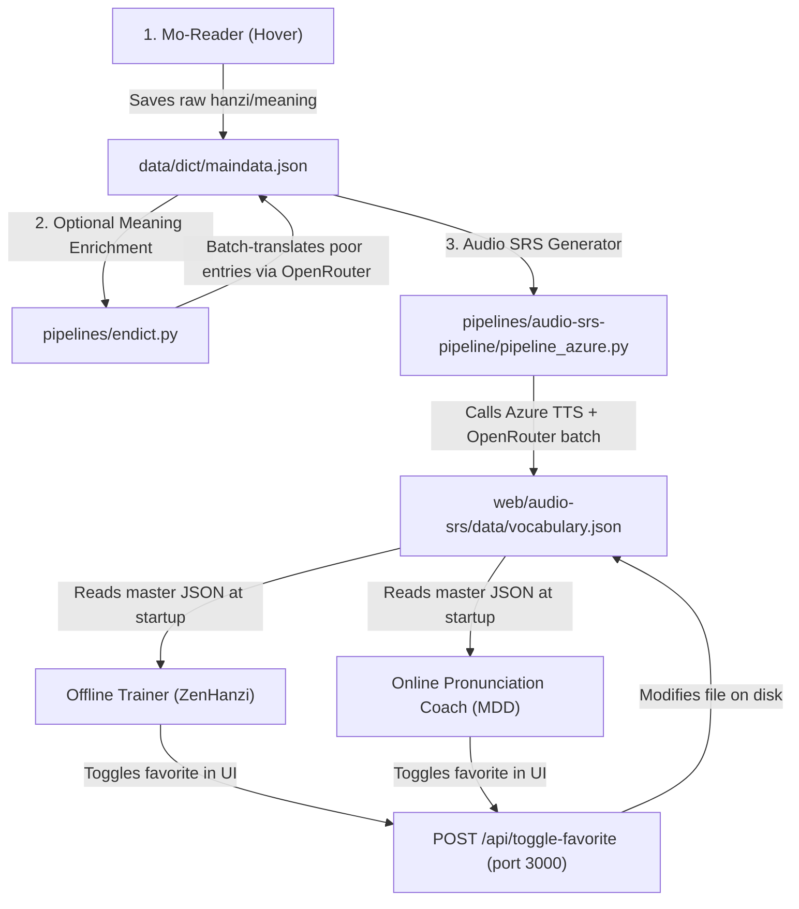

# Ultimate Project Handoff & Architecture Walkthrough

This document serves as a persistent context recovery file for **Ai-chinese** synchronization, Zero-VRAM pipeline logic, and background services. If you open a new chat with an AI assistant, point them to this file to resume work instantly.

---

## 1. 📂 Core Directory Structure

| Folder/File | Purpose | Key Details |
| :--- | :--- | :--- |
| [`web/audio-srs/`](file:///home/alex/Ai-chinese/web/audio-srs/) | Offline Trainer App (ZenHanzi) | Served on `http://localhost:8082`. Uses Vosk + WebSpeech. |
| [`services/audio-srs-mdd/`](file:///home/alex/Ai-chinese/services/audio-srs-mdd/) | Online Pronunciation Coach (MDD) | Served on `http://localhost:3000`. Uses Azure Speech API. |
| [`pipelines/audio-srs-pipeline/`](file:///home/alex/Ai-chinese/pipelines/audio-srs-pipeline/) | Zero-VRAM Audio Generator | Python scripts to generate audios, sentences, and translations. |
| [`data/dict/maindata.json`](file:///home/alex/Ai-chinese/data/dict/maindata.json) | Mo-Reader Output | Raw list of words saved from reader hovering. |
| [`web/audio-srs/data/vocabulary.json`](file:///home/alex/Ai-chinese/web/audio-srs/data/vocabulary.json) | **Master Vocabulary Database** | The single source of truth database for both study webapps. |
| [`.env`](file:///home/alex/Ai-chinese/.env) | Global Secrets | Contains shared API keys (Azure Speech, OpenRouter). |

---

## 2. 🔄 Unified Data Flow Architecture

The data flows from your reading interface all the way to Anki-like SRS study sessions:



---

## 3. 🛠️ Key Improvements Implemented

1. **Single Source of Truth Database**: 
   - Cleaned up duplicate `vocabulary.json` files. 
   - Both webapps (Vosk Offline on 8082, and Azure MDD on 3000) now read and write directly to `web/audio-srs/data/vocabulary.json`.
2. **Zero-VRAM Pipeline (`pipeline_azure.py`)**:
   - Replaced heavy local ML models (F5-TTS, PyTorch) with direct lightweight REST calls to Azure Speech and OpenRouter. 
   - The entire pipeline runs on zero VRAM, making it fully compatible with secondary laptops (e.g. 2GB VRAM).
3. **Bidirectional Favorites Sync**:
   - Created `/api/toggle-favorite` inside MDD server.
   - ZenHanzi frontend calls this endpoint in the background when stars are clicked, keeping the master file updated.
   - Added a star button on the MDD frontend sentence study card to allow real-time toggling.
4. **Automated User Service**:
   - Setup Systemd user service running Node `v25.1.0` (avoiding compiler mismatches with the SQLite native package).
   - Starts automatically on boot.

---

## 4. 🚀 Execution & Command Cheatsheet

### A. Run meaning enrichment (LLM Spanish Translation)
Translates raw definitions in `maindata.json` into multi-sense definitions separated by `/`:
```bash
# Dry run check
uv run pipelines/endict.py data/dict/maindata.json --dry-run

# Run actual enrichment using OpenRouter (Gemini 2.5 Flash)
uv run pipelines/endict.py data/dict/maindata.json --in-place --provider openrouter --model google/gemini-2.5-flash
```

### B. Run Audio/Sentence generation pipeline
Generates sentences, distractors, and audio files for candidates:
```bash
# Process a 5-word test batch
uv run pipelines/audio-srs-pipeline/pipeline_azure.py --limit 5

# Force regenerations of audio files
uv run pipelines/audio-srs-pipeline/pipeline_azure.py --limit 5 --force-tts

# Run full production sync (loops over all candidate words)
uv run pipelines/audio-srs-pipeline/pipeline_azure.py
```

### C. Systemd Service Control (Port 3000 Coach)
```bash
# Restart the service
systemctl --user restart ai-chinese-mdd.service

# View active systemd logs
journalctl --user -u ai-chinese-mdd.service -n 50 -f --no-pager
```

---

## 5. 💡 How to Customize & Debug

### Filter Bypass for Manually Hovered Words
Currently, `pipeline_azure.py` skips words that exceed a Zipf frequency of `4.2` for 2-character words (which is why very common words like `差异` are filtered out). 

* **To allow common words**, increase `zipf_max_2char` in [gemini_tts_config.toml](file:///home/alex/Ai-chinese/pipelines/audio-srs-pipeline/gemini_tts_config.toml) to `5.0`.
* **To bypass filters for enriched words**, edit [pipeline_azure.py](file:///home/alex/Ai-chinese/pipelines/audio-srs-pipeline/pipeline_azure.py#L385) and check if `w.get("enriched")` is `True` or `w.get("favorited")` is `True` before running the `freq > zipf_max_2char` checks.

### Audio Output Paths
The active pipeline automatically writes audio files directly into:
* Words: `web/audio-srs/audio/`
* Sentences: `web/audio-srs/sentences/`

*Note: Any files inside `pipelines/audio-srs-pipeline/audio/` or `sentences/` are legacy leftovers from previous local ML models and can be safely ignored or deleted.*
